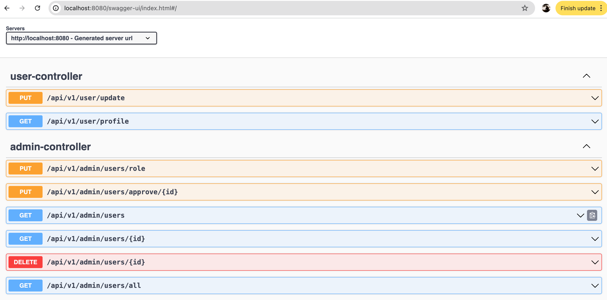
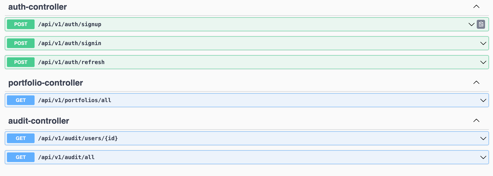

>> User-management App

- Swagger UI Page - http://localhost:8080/swagger-ui/index.html

- H2 Database console - http://localhost:8080/h2-console/

- JWT Auth with token and ROLE based

Admin login details (user added when boot up)
- username: admin123 
- password: admin

Create user:
- POST : localhost:8080/api/v1/auth/signup
- POST: localhost:8080/api/v1/auth/signin
- GET: localhost:8080/api/v1/user/profile

Audit:
- GET: localhost:8080/api/v1/audit/all
- GET: localhost:8080/api/v1/audit/users/2

TODO:
- Test cases
- Portfolio add/delete
- Api Gateway for auth?
- High availability and resiliency.
